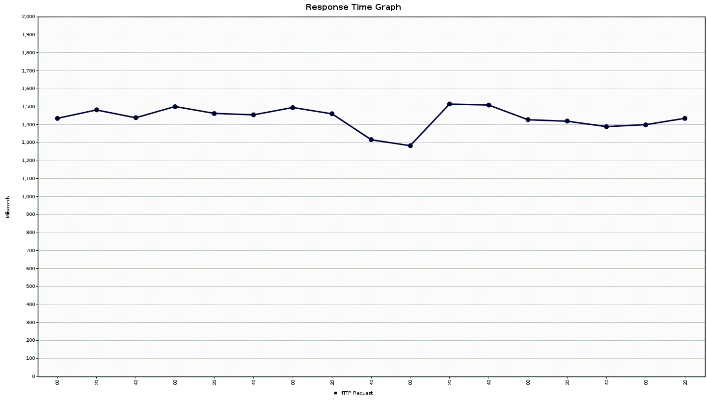
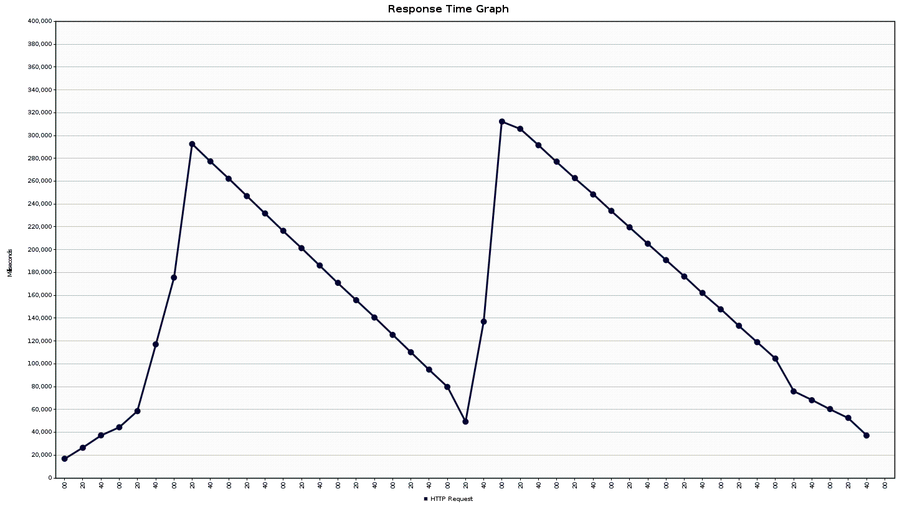
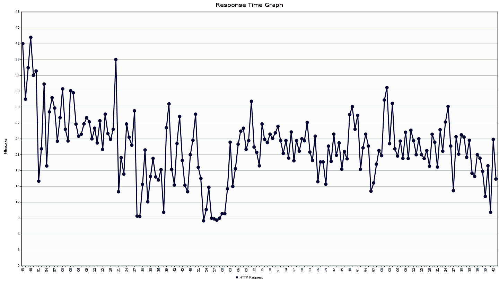
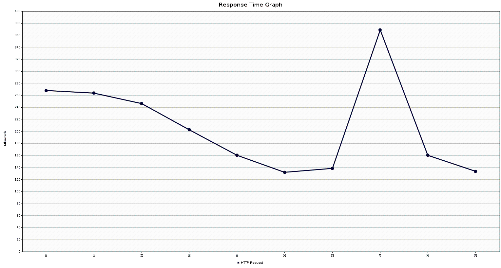
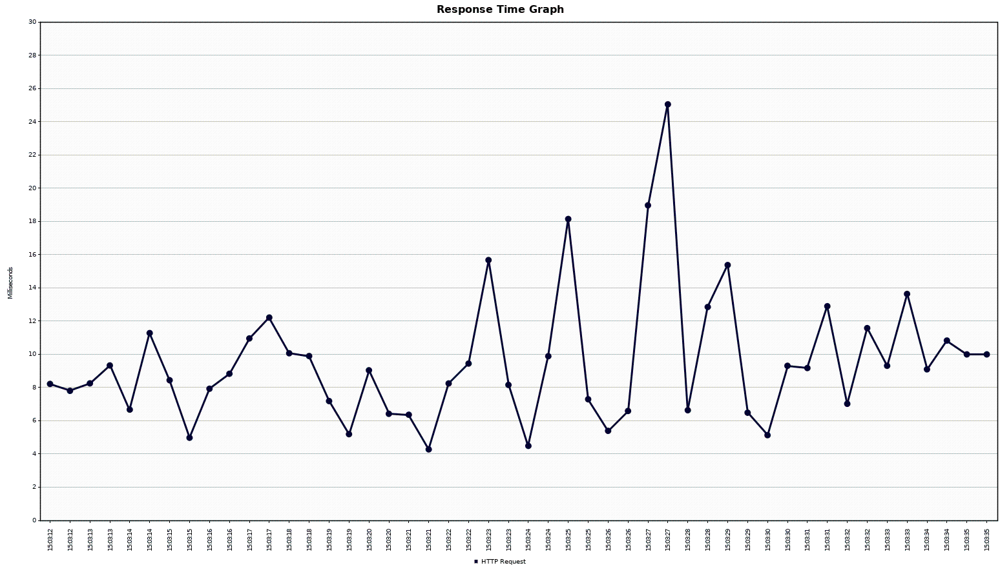
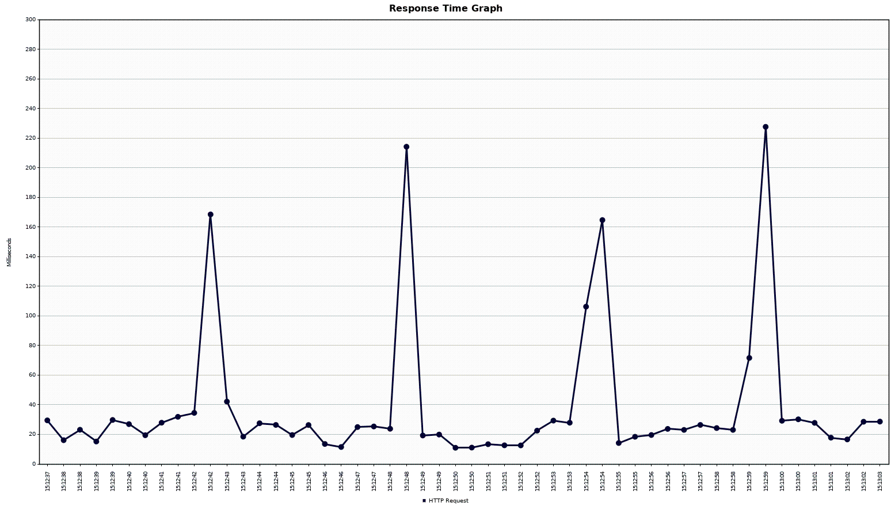

## Load Testing

We have done some performance tests of our web page. The JMeter config may be found at the project root.

### 1 million entries

#### With ressource tier pagination (Databse scope)

Using JMeter to simulate 20 users, making 100 requests each (20009 total). And we added a gaussian random timer between each request, with a constant delay of 200ms, and 100ms Standard deviation. 

We can see that in the average we have a pretty good performance with a load of the page in 1s. The server handles the requests in seconds.

#### With service tier pagination (Controller scope)

We simulated 2 users doing 10 requests each (20 requests total). And with a Gaussian random timer with a constant delay of 2000ms.
These conservative settings are required, otherwise the server is unable to reply to the requests in any usable sense.

We can see that the server sometimes handles the requests in minutes, and it can take a large amount of the RAM (actually all of it on a 16GB Ram laptop). We can see spikes and drops of the response time, probably due to memory usage, as well with slow garbage collection or swap memory usage. But regardless of the reason, we can see that is not very efficient.

### 20'000 entries

#### With ressource tier pagination

Simulating 20 users doing 100 requests each (2000 requests total). With a Gaussian random timer and a constant delay of 200ms.

The server handles the queries much faster, probably due to the fact that the datastore can now finally keep up with the requests

#### With service tier pagination

Simulating 2 users doing 10 requests each (20 requests total). With a Gaussian random timer and a constant delay of 2000ms.

We can see that the server can now handle the requests much better.
But it still eats through RAM (full ram usage within 10 requests), and ends up spiking once near the end.

### 1000 entries

#### With ressource tier pagination

Simulating 20 users doing 100 requests each (2000 requests total). With a Gaussian random timer and a constant delay of 200ms.

With 1k entries we can see that the server is really fast. The RAM taken is quite neggliable.

#### With Service tier pagination

Simulating 20 users doing 100 requests each (2000 requests total). With a Gaussian random timer and a constant delay of 200ms.

With 1k entries and Service tier paging we an see that is pretty fast but still not as fast as the ressource tier solution.

## Conclusion
We can see that for a large amount of data, pagination is required for any real world use. In fact, the server sometimes dies trying to respond to a large amount of requests with a pagination implemented on the service tier. So we see the importance of loading only the required data.

We also realise that those request times are quite long, all things considered. We attribute that to the fact that the server is trying to sever a complex object, relying on 4 table jointures for each item it acceses (as can be seen in the Business Model schema), which slows the request response speed down quite a lot. 

---
[Return to the main readme](https://github.com/capito27/Teaching-HEIGVD-AMT-2019-Project-One/blob/master/README.md)
