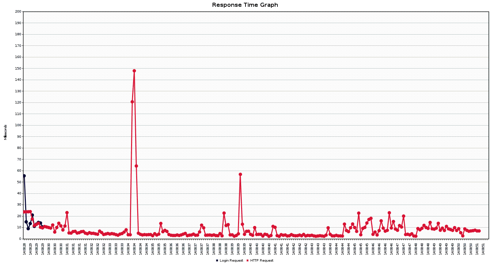
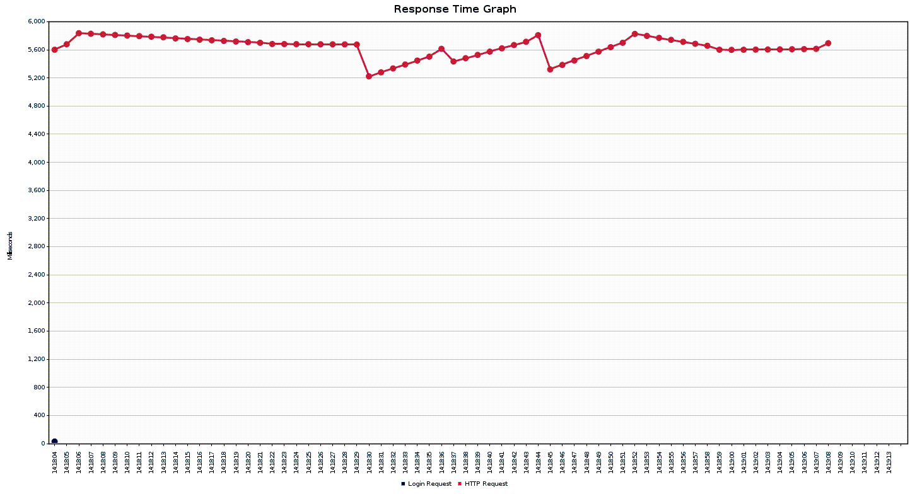

## Load Testing

We have done some performance tests of our API. The general settings of the JMeter config may be found at the project root.
We have a login request before each round of iteration and added some HTTP Headers controllers to have the token in each request.test

### 1 million entries

#### With ressource tier pagination (Database scope)

Using JMeter to simulate 20 users, making 100 requests each (20'000 total). And we added a gaussian random timer between each request, with a constant delay of 200ms, and 100ms Standard deviation. The pagesize choosen was 100 (/api/app/matches?page=1&pageSize=100).

We can see that in the average we have a pretty good performance with a load of the page in some milliseconds. The server handles the requests in milliseconds.

#### With service tier pagination (Controller scope) (Simulated)

We simulated 2 users doing 10 requests each (20 requests total). And with a Gaussian random timer with a constant delay of 2000ms.
We simulated the server doing no pagination at all by putting a pageSize of 1'000'000 entries (/api/app/matches?page=1&pageSize=1000000).

We can see that the server sometimes handles the requests in seconds. We can see spikes and drops of the response time, probably due to memory usage, as well with slow garbage collection or swap memory usage. But regardless of the reason, we can see that is not very efficient. But 5 seconds is not so long for 1'000'000 entries.

### Ameliorations
Before having such a nice time we had some difficulties. In fact, we had this kind of performances before enabling caching in DB side.

Using JMeter to simulate 20 users, making 100 requests each (20'000 total). And we added a gaussian random timer between each request, with a constant delay of 200ms, and 100ms Standard deviation. The pagesize choosen was 100 (/api/app/matches?page=1&pageSize=100).

These performances are impressive, we were at 700ms in average to like 8 - 10ms.

## Conclusion
We can see that for a large amount of data, pagination is required for any real world use. In fact, the server sometimes dies trying to respond to a large amount of requests with a pagination implemented on the service tier. So we see the importance of loading only the required data.

We also realise that those request times are quite long, all things considered. We attribute that to the fact that the server is trying to serve a complex object, relying on 4 table jointures for each item it acceses (as can be seen in the Business Model schema), which slows the request response speed down quite a lot.
But with database caching we can see really good improvements.

We made a lot of small tests that you can see on /assets/test_* but don't comment all of them.

---
[Return to the main readme](https://github.com/capito27/Teaching-HEIGVD-AMT-2019-Project-One/blob/master/README.md)
